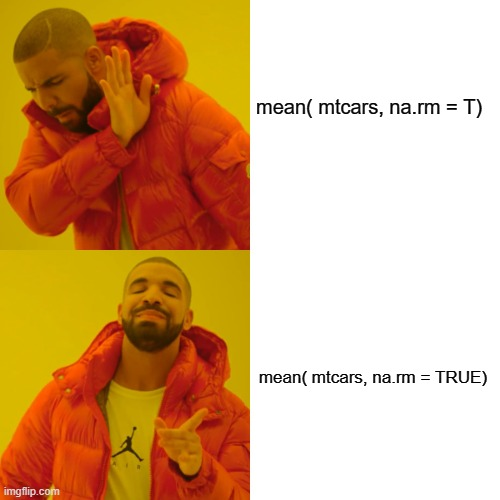

# Should you use `T` or `TRUE` in R?



In R, `T` and `F` are used interchangeably with `TRUE` and `FALSE` quite often, but they might not be safe and can lead to errors.

`TRUE` and `FALSE` are reserved words in R, which means you can't use them for assignment. 
``` r
TRUE = mtcars
#> Error in TRUE = mtcars: invalid (do_set) left-hand side to assignment
```

But same is not true for `T` and `F`. These are not reserved words and can be used for assignment.
``` r
T = mtcars
```
Now if `T` is used as `TRUE`, you might not get what you expected, as `T` is now a dataframe (`mtcars`).
```r
T = mtcars
mean(mtcars, na.rm = T)
#> Warning in mean.default(mtcars, na.rm = T): argument is not numeric or logical:
#> returning NA
#> [1] NA
```

  
