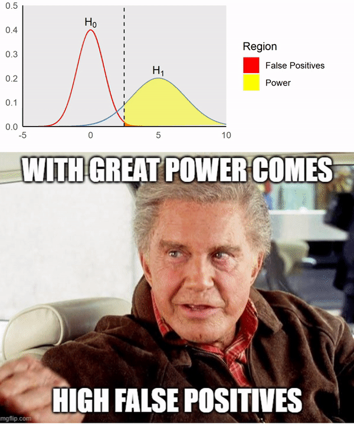

# With great Power comes....

False positives occur due to the rejection of true null hypothesis, which is the region to the right of cutoff values and under $H_0$. Power is the probability of rejecting a false null hypothesis, which is the region to the right of cutoff values and under $H_1$. By moving the cut-offs to the left, the power can be increased but at the expense of increasing Type 1 error rate. 
